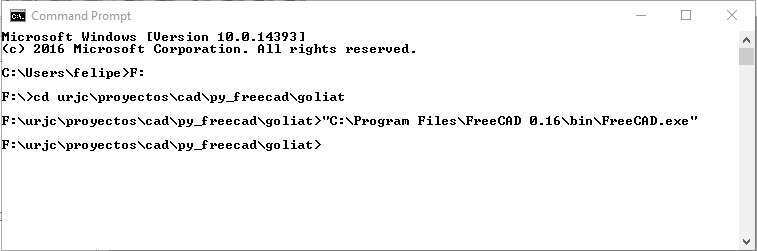

# FreeCAD Model of the Goliat printer/mill made from Python scripts for FreeCAD

The `goliat.py` file is run inside FreeCAD.
Read the following tutorial to know how to run a python script from FreeCAD
http://www.freecadweb.org/wiki/index.php?title=Python_scripting_tutorial

To run this file, run FreeCAD in the directory you have the `goliat.py` file

For example, in Windows, I run `cmd`, and then I go to the goliat directory. From there, I run FreeCAD. See the following image:




Then, from the FreeCAD Python console, run:


```
execfile('goliat.py')
```

# Dependencies

The `goliat.py` script has a lot of functions and classes defined in other files. The have been grouped in a repository called  `comps`
These files are in https://github.com/felipe-m/fcad-comps

To keep track of the version of comps that has been used in each versions of goliat, this `goliat` repository has a version of `comps` that works. This `comp` version is in `module/comps`.
However, if you need to change `comps`, I would do it on the original repository, and then bring those files to `goliat` 

Actually, I work with the `goliat` and `comps` directories at the same level. Since `comps` is used in other projects, it doesn't make sense to have it inside `goliat`.

Following I show an example of the file structure that I have in my computer, 
```
cad/
  +-- py_freecad              # python scripts for FreeCAD
      +-- goliat                # goliat scripts
          +-- goliat.py             # Goliat printer
      +-- comps               # library of components
          +-- comps.py            # components
          +-- kcomp.py            # constants about components
          +-- fcfun.py            # library of functions
      +-- corexy              # python scripts for coreXY printer
          +-- carriage.py         # carriage of the 3D printer 
```


